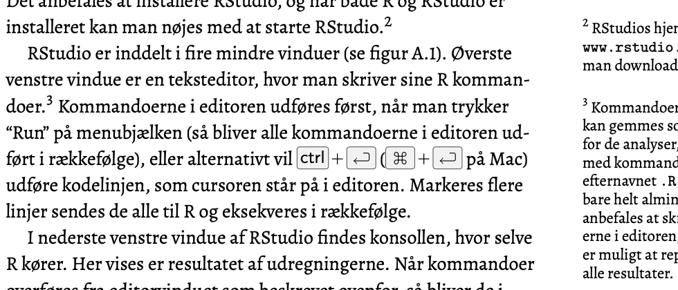

--- 
title: "Introduktion til R"
author: "Claus Thorn Ekstrøm"
date: "`r Sys.Date()`"
site: bookdown::bookdown_site
documentclass: book
bibliography: [book.bib, packages.bib]
# url: your book url like https://bookdown.org/yihui/bookdown
cover-image: pics/fakecover.png
description: |
  Denne "bog" indeholder en introduktion til R og omfatter et kapitel fra en kommende dansk statistikbog. Kommentarer, forslag og ændringer modtages meget gerne.
  Kapitlet vil blive lagt online til fri afbenyttelse.
link-citations: yes
github-repo: ekstroem/RIntro
---

# Om denne "bog"

Denne hjemmeside indeholder udkastet til en intro-kapitel om R til en kommende danske lærebog i statistik. Kapitlet skal bruges som første skriftlige præsentation af R for de studerende, og tanken er, at kapitlet inkluderes som et appendiks i en statistiklærebog og bliver frit tilgængeligt online. Muligvis bliver kapitlet kun lagt online - det afhænger lidt af udformningen af resten af lærebogen.

Fokus i lærebogen og på kurserne er på *statistik*, og det skal derfor *ikke* være en R bog. Samtidig er det imidlertid vigtigt at give læseren et værktøj, så de kan lave nogle af de almindelige beregninger, og det er her, at R kommer ind i billedet. Af samme grund indeholder kapitlet kun en minimale indføring i R - selve det at modellere, analysere, tegne grafik og fortolke resultaterne dukker op sammen  med de pågældende statistikbegreber.

## Du kan hjælpe til

Kommentarer, forslag, rettelser og ideer modtages med kyshånd. Hvis du har lyst til at bidrage, så er du meget velkommen til at submitte pull-requests. Hvis ikke du er så velbevandret i git/github så er du også meget velkommen til at sende mig en mail eller finde mig på [twitter](https://twitter.com/ClausEkstrom) / [linkedIn](https://www.linkedin.com/in/clausekstroem/) og sende en besked der igennem.

Layout er ikke vigtigt i denne omgang (og fodnoterne kommer til at fungere bedre i det endelige produkt), men alle kommentarer omkring indhold vil være gode!

Lige en ting mere: Der er nogle enkelte symboler, der *ikke* bliver vist i denne version af onlinebogen. Det er ikke nødvendigt at kommentere på de steder (der er vist kun 2). Et eksempel ses nedenfor.




```{r include=FALSE}
# automatically create a bib database for R packages
knitr::write_bib(c(
  .packages(), 'bookdown', 'knitr', 'rmarkdown'
), 'packages.bib')
```


```{r echo=FALSE, message=FALSE, warning=FALSE}
figoutwidth <- "80%"
library("tidyverse")
```

